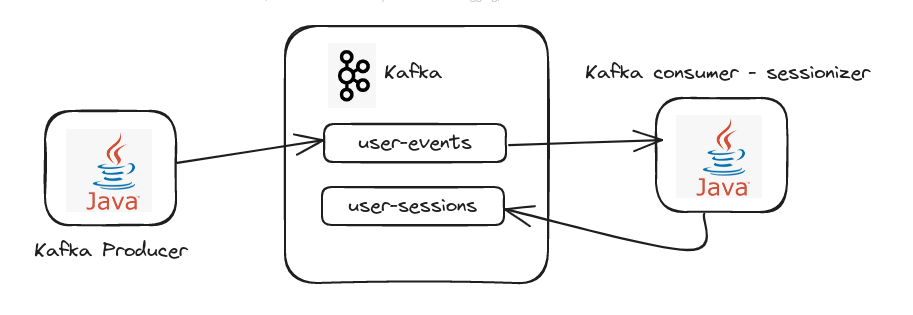
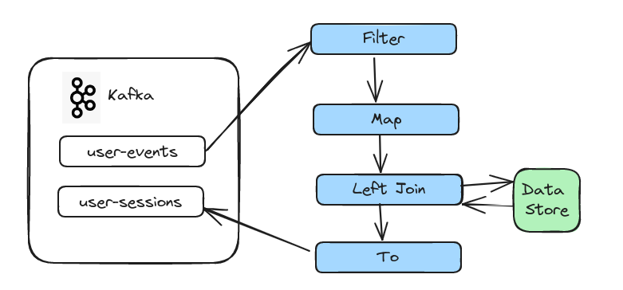

# Kafka Streams Session Creator

This application is an example of how we can use Kafka Streams to create stateful application using KTable to retrieve
The most recent value of the key sent to the changelog topic. The application enriches the user interaction event with
a new attribute named session_id. The session_id value is calculated based on the generation time interval of the
event(event_timestamp) between the current event and previous event. If the interval between the current and previous event is
less than 30 minutes, then the same session_id as the previous event is assigned. Otherwise a new session_id is created,
characterizing downtime greater than 30 minutes.

Example:

1 - The user accesses the website and login in to access their account. This action generates an event for the user_events topic:

{"anonymous_id": 1, "action": "login", "event_timestamp": "1697504400", "event_datetime": "2023-10-17 01:00:00"}

2 - Since it is the user's first event, the application creates a new session_id for the event:

{"anonymous_id": 1, "action": "login", "event_timestamp": "1697504400", "event_datetime": "2023-10-17 01:00:00", "session_id": "12345"}

3 - After 2 minutes the user clicks on a product, generating an event:

{"anonymous_id": 1, "action": "click_product", "event_timestamp": "1697504520", "event_datetime": "2023-10-17 01:02:00"}

4 - The application identifies that the difference in event generation time between the current and previous events is less than 30 minutes
and assigns the same session_id as the previous event:

{"anonymous_id": 1, "action": "click_product", "event_timestamp": "1697504520", "event_datetime": "2023-10-17 01:02:00", "session_id": "12345"}

5 - After 58 minutes the user clicks on another product, generating an event:

{"anonymous_id": 1, "action": "click_product", "event_timestamp": "1697508000", "event_datetime": "2023-10-17 02:00:00"}]

4 - The application identifies that the difference in event generation time between the current and the previous one is greater than 30 minutes and creates
a new session_id for the event:

{"anonymous_id": 1, "action": "click_product", "event_timestamp": "1697508000", "event_datetime": "2023-10-17 02:00:00", "session_id": "678910"}


## Application Diagram
Here is a simple diagram for this application:



A aplicação ler eventos do tópico de entrada `user-events`, cria o sessio_id para o usuário e envia cada evento para 
o tópico de saída `user-sessions`.

## Requirements
* Docker + Docker-Compose: We will use it to start broker, schema registry and zookeeper.
* Gradle 7.4 +
* Java 11
* An IDE like Intellij IDEA
* 
## Running the project

### 1. Starting Kafka

We need to start the services Broker, schema registry and zookeeper. For that we have a 
[docker-compose.yml file](docker-compose.yml) that will create the necessary resources for us. To make things easier, 
some utility commands were created to help create these services:

```shell
make build_services
```

### 2. Create the input/output topics.

```shell
make create_topics
```
### 3. Create avro schema in Schema Registry

```shell
chmod +x scripts
make create_schemas
```

### 4. Write some input data to the source topics

#### 4.1. Clone Repository

- Clone this repo to your local machine using `https://github.com/toni-carlos/demo-kafka-producer.git`
- git checkout producer-user-event

#### 4.2. Run event producer

```shell
gradle build run
```

### 5. Validate that data was sent to the source topic.

```shell
chmod +x scripts
make consumer_topic TOPIC=user-events
```

### 6. Now let's run the application

```shell
gradle build run
```

## Running the Tests
```shell
gradle test
```

## Understanding the Topology



1️⃣ **Filter** validates whether the event is valid.

2️⃣ **Map** Converts key and value to avro object of type GenericRecord.

3️⃣ **Left Join** Retrieve data from the previous event by left joining the changelog table. This is necessary to calculate the session id of each event.

4️⃣ **To** Finally, we stream the results into the topic `user-sessions`.

## Clean services created to run the demo

```shell
make clean_services
```


